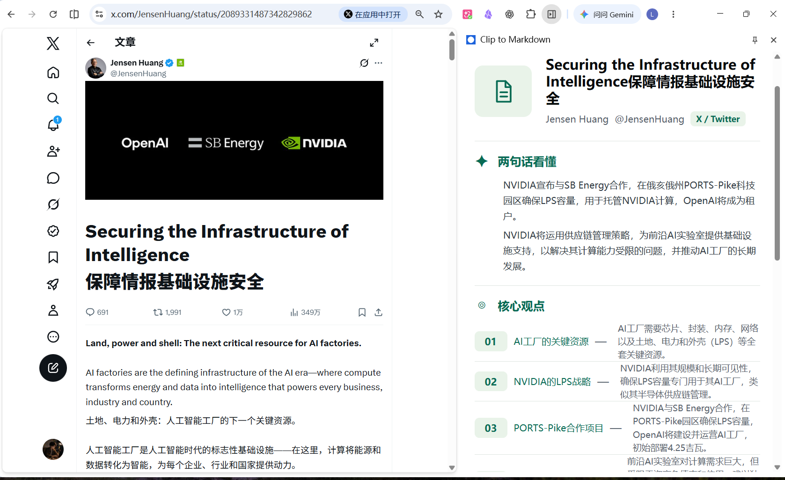
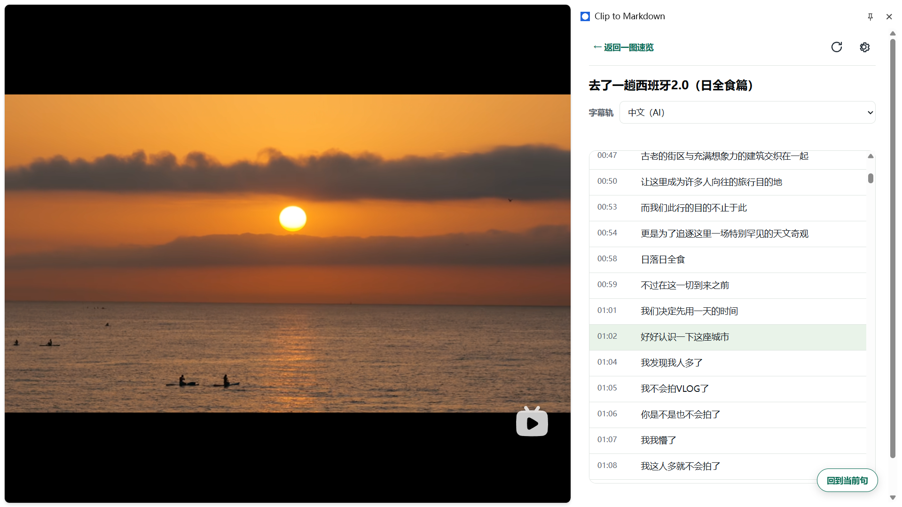

# 👁️ GlanceClip

**先看懂，再收藏。** 一款面向 **X、知乎、Bilibili、ChatGPT、小黑盒** 的 AI 浏览器阅读与 Markdown 剪藏助手。

**[安装到 Chrome](https://chromewebstore.google.com/detail/clip-to-markdown/ncfnjmgfjnggekjomeflbnoihcmelhal)** · **[安装到 Edge](https://microsoftedge.microsoft.com/addons/detail/clip-to-markdown/cbjlhmmghfglniaohpodmpjhcinnbplj)**

> README 展示名为 GlanceClip；商店和浏览器中的扩展名称仍为 **Clip to Markdown**。

## ✨ 核心功能

### 一图速览

按 `Ctrl + Shift + Y` 打开侧栏，快速获得：

- 两句话摘要与核心观点
- 清晰的内容结构
- 点击结构条目定位原文；B站可跳转到字幕或章节时间点
- 确认值得收藏后，直接保存 Markdown

X 的可靠原文定位仅支持 X Article；普通推文没有可靠锚点时保持静态展示。



### B站字幕阅读

B站视频或分 P 页面可以进入 **B站独立字幕页**：

- 读取平台提供的人工或 AI 字幕轨
- 手动切换字幕轨，播放时自动跟随当前句
- 点击字幕跳转到对应时间，并保持原播放状态
- 没有字幕时仍可保存标题、简介和章节



字幕功能不下载视频、不做本地或云端语音识别，也不做画面 OCR（**无ASR**）。

### 一键收藏

- 保存为 Markdown：浏览器下载目录或自定义文件夹
- 保存到 Obsidian：通过本机 Local REST API 写入 Vault
- 尽可能保留标题、列表、链接、引用、代码块、表格和图片等 Markdown 结构
- 尽量排除评论、回复、推荐、广告、侧边栏和操作按钮

文件名默认使用 `{date}-{title}`，也可配置为 `{date}-{platform}-{author}-{title}`。

## 🌐 支持平台

| 平台 | Markdown | 一图速览 | 原文定位 | 字幕阅读 |
| --- | --- | --- | --- | --- |
| X | 普通推文、X Article | ✅ | X Article | — |
| 知乎 | 回答、文章 | ✅ | ✅ | — |
| Bilibili | 视频信息、简介、章节、字幕 | ✅ | 字幕/章节时间点 | ✅ |
| ChatGPT | 用户与助手对话 | ✅ | ✅ | — |
| 小黑盒 | 帖子、图文帖子 | ✅ | ✅ | — |

## ⚡ 快速使用

打开受支持平台的内容详情页，然后使用：

| 功能 | Windows / Linux | macOS |
| --- | --- | --- |
| 一图速览 | `Ctrl + Shift + Y` | `Command + Shift + Y` |
| 保存 Markdown | `Ctrl + Shift + S` | `Command + Shift + S` |
| 保存到 Obsidian | `Alt + Shift + S` | `Alt + Shift + S` |

快捷键冲突时，可在 `chrome://extensions/shortcuts` 中重新绑定。

## 🔧 配置与隐私

### AI 服务

一图速览使用 OpenAI-Compatible API。扩展设置页已预填以下配置：

- Endpoint：`https://api.deepseek.com/chat/completions`
- Model：`deepseek-v4-flash`

你只需填写自己的 API Key，并启用 AI 功能。Endpoint 和模型仍可修改为其他兼容 Endpoint/模型；扩展不会替你提供 API Key，需在设置页完成配置后再使用一图速览。

只有主动生成一图速览时，当前内容文本才会发送到该服务。API Key 保存在浏览器本地，项目不自建内容服务器。

### B站字幕翻译

只有在没有官方简体中文、存在英文字幕且用户显式开启翻译时，才会显示 **简体中文（AI 翻译）**。

翻译只发送英文字幕文本，**不会发送音频或视频**，也不会发送 BV 号、标题或作者；调用 AI 服务**可能产生费用**。

### Obsidian

在 Obsidian 中启用 **Local REST API with MCP**，然后在扩展设置页填写：

- API 地址，例如 `http://127.0.0.1:27123`
- API Key
- Vault 内相对目录，例如 `Clippings/Inbox`

不要填写 `C:\...` 形式的电脑绝对路径。

## ❓ 常见问题

**显示“不支持当前页面”**
请打开具体内容详情页，等待正文加载完成后重试。

**保存后找不到文件**
检查自定义文件夹、浏览器下载目录、下载子目录或 Obsidian Vault。

**Obsidian 连接失败**
确认 Obsidian 正在运行，Local REST API、HTTP Server、API 地址和 API Key 均已正确配置。

## 🛠️ 从源码安装与开发

需要 Chrome 116+ 或兼容的 Edge，以及 Node.js。

```bash
git clone https://github.com/LC9999216/clip2md.git
cd clip2md
npm ci
npm run build
```

打开 `chrome://extensions`，启用“开发者模式”，选择“加载已解压的扩展程序”，加载项目中的 `dist` 文件夹。

开发命令：

```bash
npm run build
npm run watch
npm run typecheck
npm test
```

修改源码后重新运行 `npm run build`，再到扩展管理页点击“重新加载”。

## 🤝 Contributing

欢迎提交 [Issue](https://github.com/LC9999216/clip2md/issues) 和 Pull Request。

B站字幕实现参考了 [biuworks/bilibili-digest](https://github.com/biuworks/bilibili-digest)（MIT）的字幕获取、WBI 签名与轨道处理思路；第三方说明见 [THIRD_PARTY_NOTICES.md](THIRD_PARTY_NOTICES.md)。

## 📄 License

[MIT License](LICENSE)
